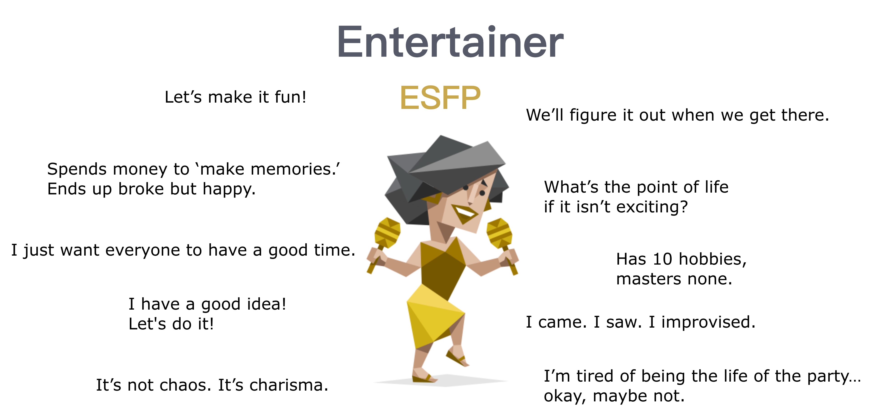

---
# Display name
title: Yuxuan SONG 宋俞萱

# Name pronunciation (optional)
name_pronunciation: ''

# Full name (for SEO)
first_name: Yuxuan
last_name: SONG

# Status emoji
status:
  icon: 😆

# Is this the primary user of the site?
superuser: true

# Highlight the author in author lists? (true/false)
highlight_name: true

# Role/position/tagline
role: PhD Student

# Organizations/Affiliations to display in Biography blox
organizations:
  - name: Inria Paris, Team AIO
    url: https://aio.inria.fr/ 
  - name: Sorbonne University

# Social network links
# Need to use another icon? Simply download the SVG icon to your `assets/media/icons/` folder.
profiles:
  - icon: at-symbol
    url: 'mailto:syxenfrance@163.com'
    label: E-mail Me
  - icon: brands/weixin
    url: '/uploads/weixin.jpg'  
  - icon: brands/github
    url: https://github.com/ysong02 
  - icon: brands/linkedin
    url: https://www.linkedin.com/in/yuxuan-song-392392223
  - icon: academicons/google-scholar
    url: https://scholar.google.com/citations?user=kMAcBqAAAAAJ

interests:
  - Low Power Wireless Communications
  - Internet-of-Things
  - Network Security
  - Micro-robots

education:
  - area: PhD in Electronic Information and Communication Engineering
    institution: Sorbonne University & National Institute for Research in Digital Science and Technology (Inria) Paris
    date_start: 2015-10-01
    date_end: 2026-09-30
    summary: |
      Thesis on _Remote Attestation for Internet-of-Things Swarms_. Supervised by Dr. Thomas Watteyne and Dr. Malisa Vucinic.
    button:
      text: 'Read Thesis'
      url: /uploads/thesis.pdf
  - area: M.Sc. and M.Eng. in Telecom
    institution: Institut national des sciences appliquées de Lyon (INSA Lyon)
    date_start: 2020-09-01
    date_end: 2023-08-31
    summary: |
       Specialized in Telecommunications
  - area: Exchange in Electrical Engineering
    institution: Korea Advanced Institute of Science and Technology (KAIST)
    date_start: 2022-09-01
    date_end: 2023-01-31
    icon: kaist
    summary: |
      Exchanged in Electrical Engineering Department.
  - area: Foundation in Mathematics and Computer Engineering
    institution: Institut national des sciences appliquées de Rouen (INSA Rouen)
    date_start: 2018-11-01
    date_end: 2020-07-31
    summary: |
      Majored in Science, and I chose the Mathematics and Computer Engineering

work:
  - position: Network engineer
    company_name: Société française du radiotéléphone (SFR) 
    company_url: 'https://www.sfr.fr/'
    company_logo: '/uploads/SFR-logo.png'
    date_start: 2023-02-20
    date_end: 2023-07-28
    summary: |
      Audit of radio parameters using SQL, PHP.
      Evaluation: 13.5/14

  - position: Network Research Intern
    company_name: National Institute for Research in Digital Science and Technology (Inria) Lyon
    company_url: 'https://www.inria.fr/fr/centre-inria-de-lyon'
    company_logo: ''
    date_start: 2019-06-01
    date_end: 2019-12-31
    summary: |
      Worked on GPT-3 scaling. Co-authored paper on prompt engineering.

# Skills
# Add your own SVG icons to `assets/media/icons/`
skills:
  - name: Technical Skills
    items:
      - name: Python & PyTorch
        description: ''
        percent: 95
        icon: code-bracket
      - name: Machine Learning
        description: ''
        percent: 100
        icon: chart-bar
      - name: Cloud Computing (AWS/GCP)
        description: ''
        percent: 85
        icon: cloud
  - name: Hobbies
    color: '#eeac02'
    color_border: '#f0bf23'
    items:
      - name: Hiking in the Rockies
        description: ''
        percent: 80
        icon: person-simple-walk
      - name: Building Custom PCs
        description: ''
        percent: 90
        icon: cpu-chip
      - name: Sci-Fi Reading
        description: ''
        percent: 70
        icon: book-open

languages:
  - name: Chinese (native language)
    percent: 100
  - name: English (TOEIC C1)
    percent: 85
  - name: French (DALF C1)
    percent: 85

# Awards.
#   Add/remove as many awards below as you like.
#   Only `title`, `awarder`, and `date` are required.
#   Begin multi-line `summary` with YAML's `|` or `|2-` multi-line prefix and indent 2 spaces below.
# awards:
#   - title: Best Paper Award
#     url: https://neurips.cc/
#     date: '2022-12-01'
#     awarder: NeurIPS
#     icon: hero/trophy
#     summary: |
#       Awarded for groundbreaking work on efficient training of large models.
#   - title: AI Innovation Grant
#     url: https://www.nsf.gov/
#     date: '2021-06-15'
#     awarder: National Science Foundation
#     icon: hero/currency-dollar
#     summary: |
#       $500,000 grant for research in ethical AI development.
#   - title: Outstanding PhD Thesis
#     url: https://www.stanford.edu/
#     date: '2019-06-30'
#     awarder: Stanford University
#     icon: hero/academic-cap
#     summary: |
#       Recognized for contributions to scaling laws in deep learning.
---

Yuxuan SONG is currently working toward the Ph.D. degree in Information and Communication Technologies with the AIO team at Inria Paris and Sorbonne University, France. She received the M.Sc. and M.Eng. degrees in telecommunications, services and usages from INSA Lyon, France, in 2023. Her research interests focus on cybersecurity and low-power wireless communications for Internet-of-Things applications. She also contributes to the standardization work of attestation protocol for IoT networks at the IETF. She is fluent in Chinese, English and French. 
