Yuxuan: Fafa is growing up to be even more fluffy and adorable! Here are the highlights from year two.

Fafa: Miaow 2 miaow miaow. Miaow miaow miaow Yuxuan miaow miaow miaow. Miaow miao Zanfei miaow miaow miaow miaow. Miaow miaow miaow 猫条 miaow 啃草. Miaow miaow miaow miaow, miaow miaow?

  
  
  
  
  
  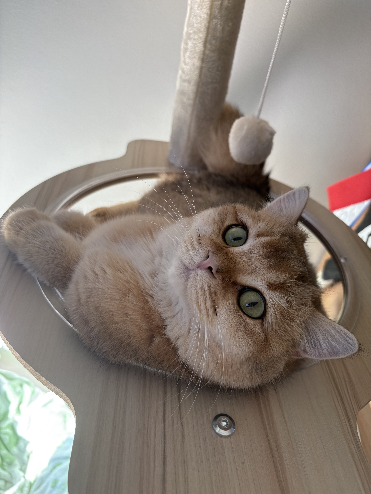
  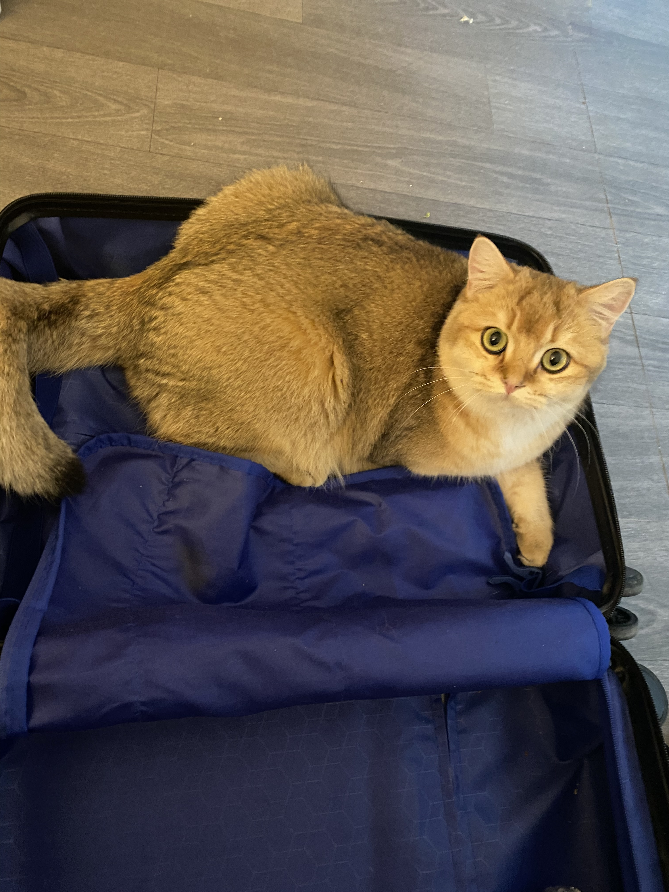 
  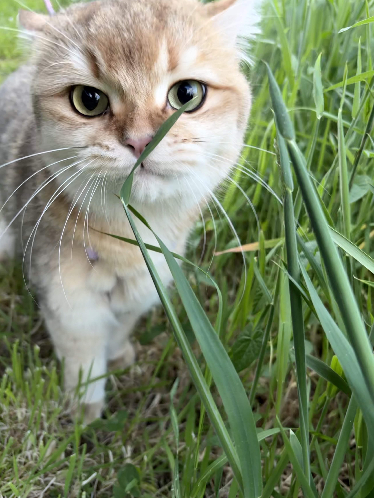
  
  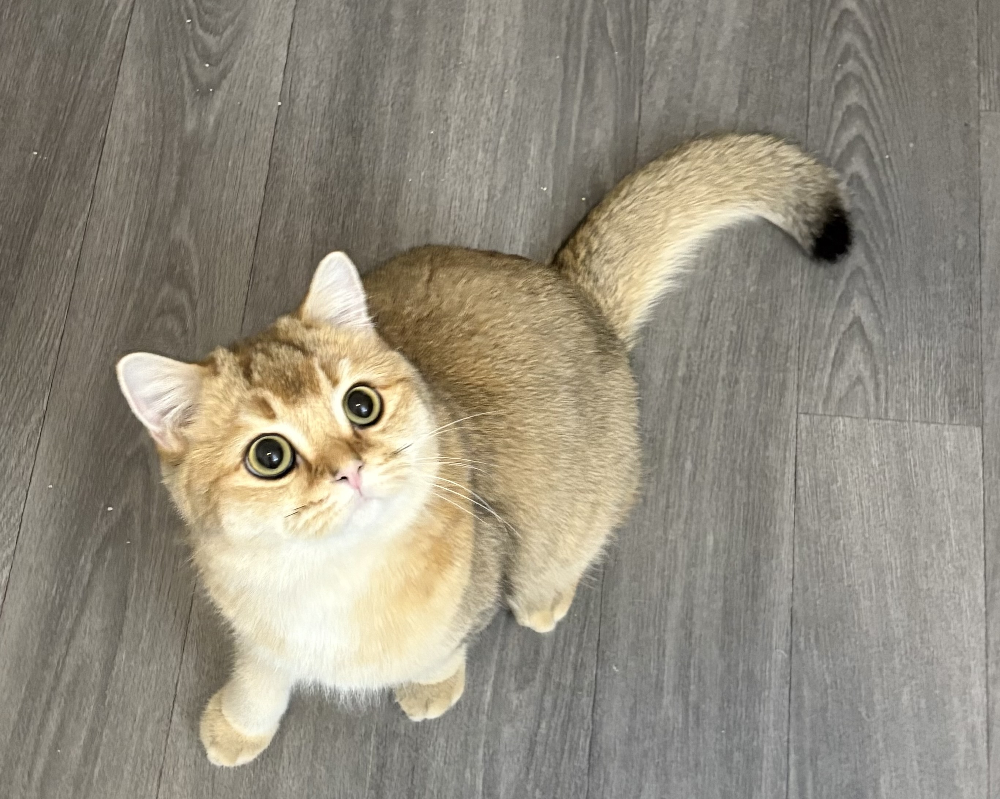
  
  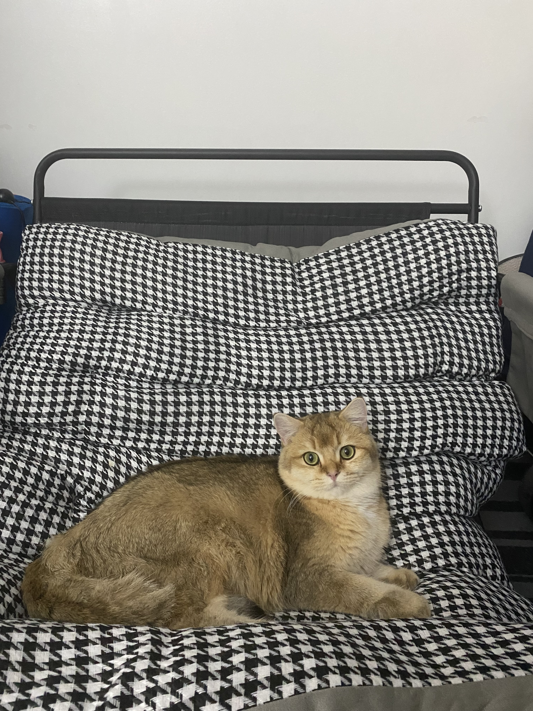
  
  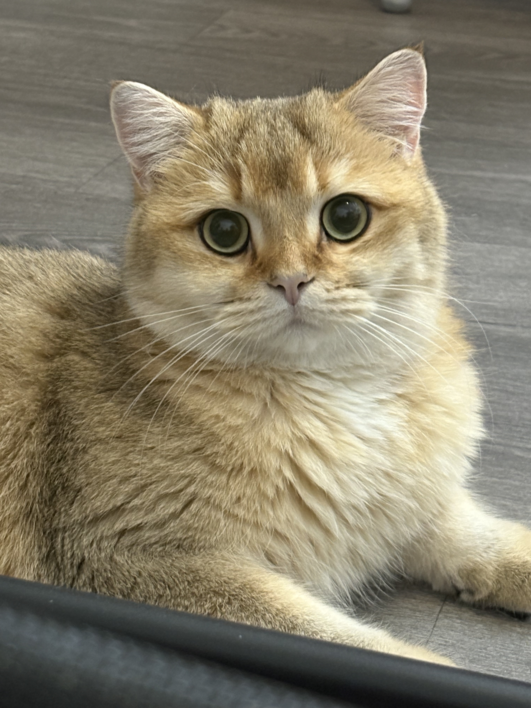
  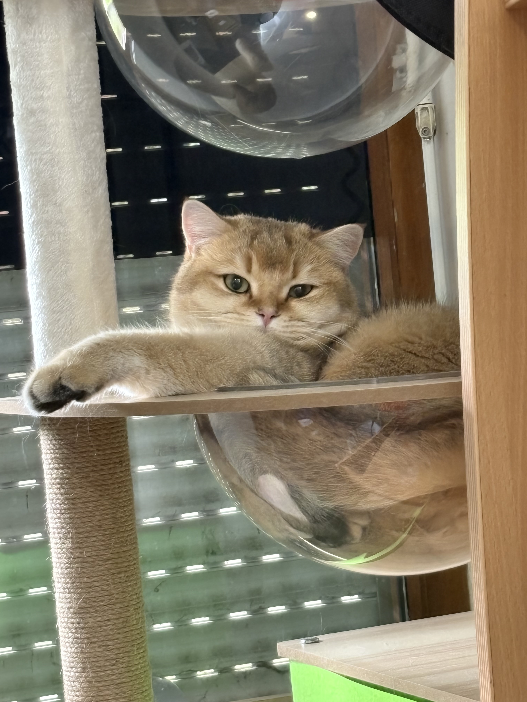
  
  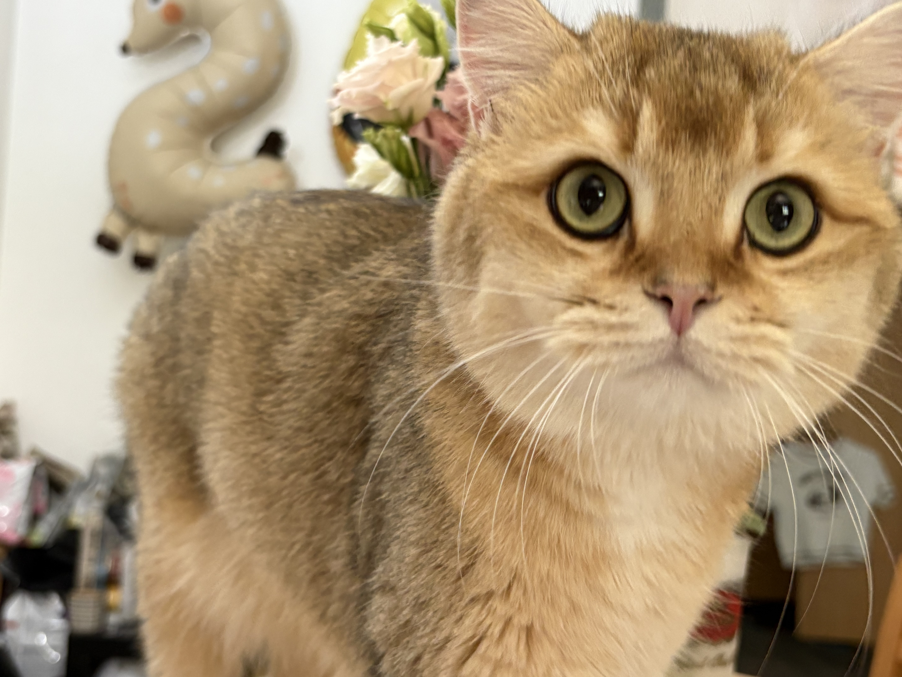

  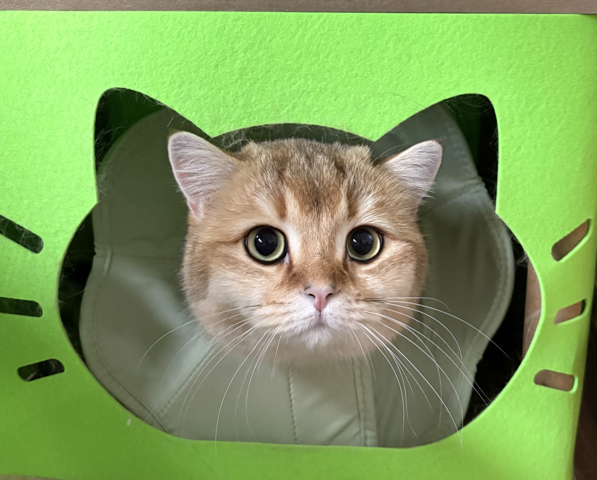
  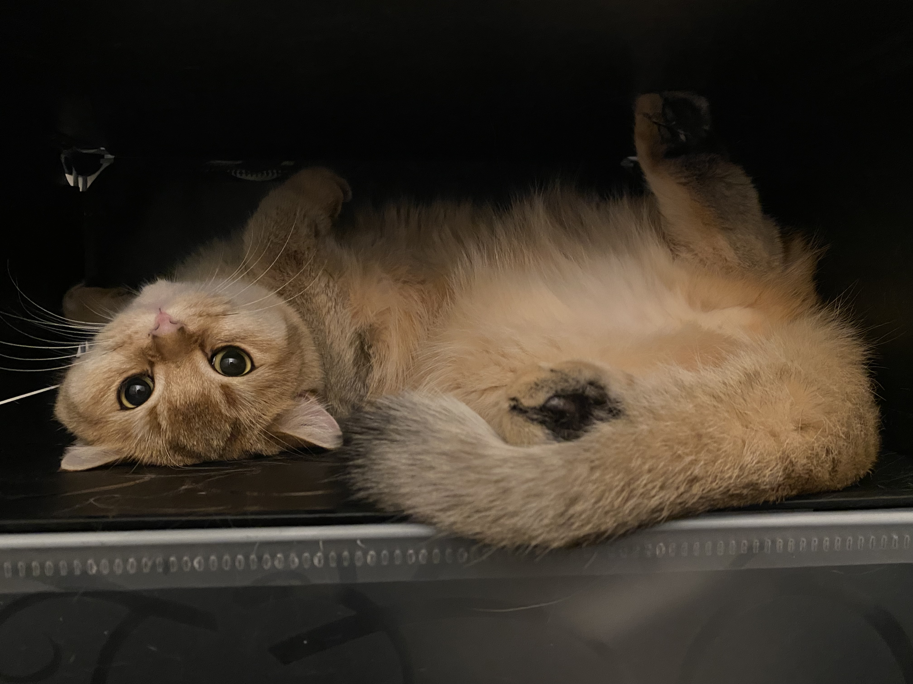
  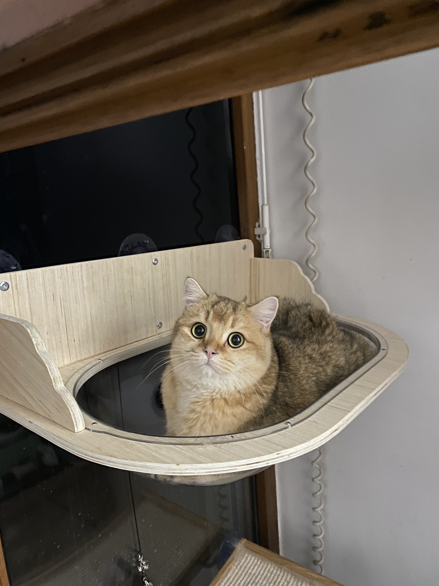
  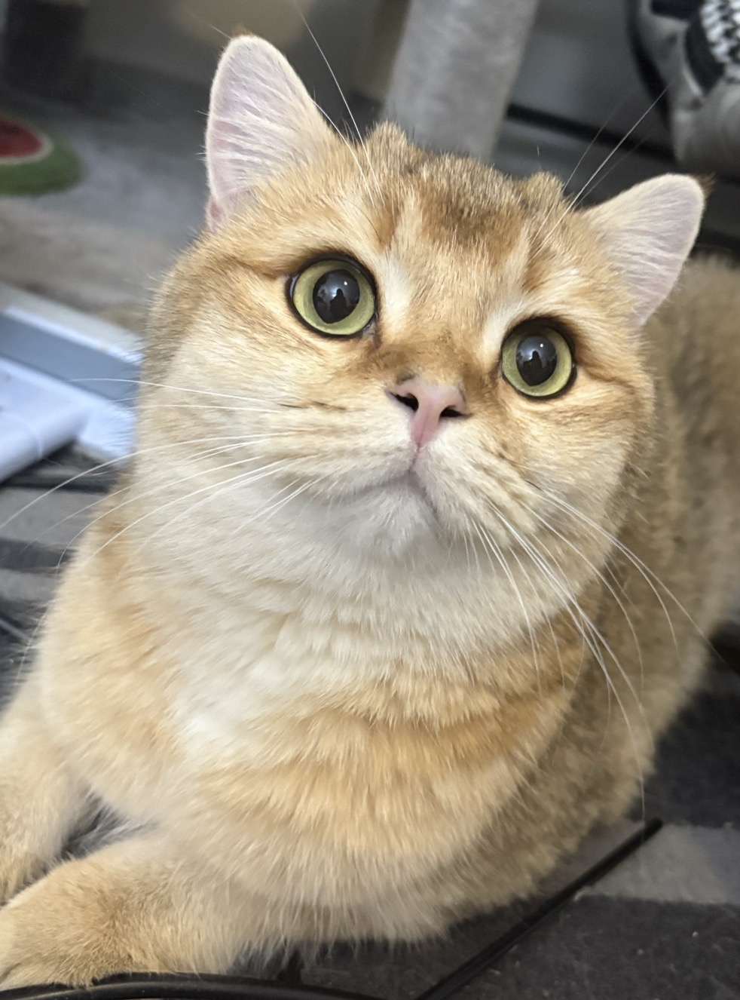
  

