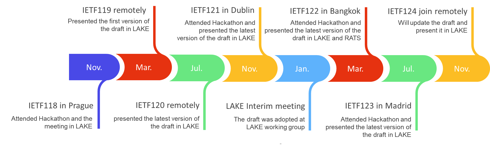

## What is the IETF?

The **Internet Engineering Task Force (IETF)** , founded in 1986, is the premier standards development organization (SDO) for the Internet. The IETF makes voluntary standards that are often adopted by Internet users, network operators, and equipment vendors, and it thus helps shape the trajectory of the development of the Internet. The goal is to make the network better. 

**Key concepts**
- **Internet-Drafts (I-Ds):** work-in-progress documents discussed in Working Groups (WGs)
- **RFCs:** archival publications that define Internet standards and best practices
- **Datatracker:** the official index of drafts, WGs, and document history
---
## My Internet-Draft at IETF
**Title:** Remote Attestation over EDHOC (LAKE WG)

**Datatracker link:**
[https://datatracker.ietf.org/doc/draft-ietf-lake-ra/](https://datatracker.ietf.org/doc/draft-ietf-lake-ra/)
### Abstract 
   This document specifies how to perform remote attestation as part of
   the lightweight authenticated Diffie-Hellman key exchange protocol
   EDHOC (Ephemeral Diffie-Hellman Over COSE), based on the Remote
   ATtestation procedureS (RATS) architecture.
### Milestone
  The Internet-Draft was adopted by the IETF LAKE working group at the beginning of
  2025, which indicates that the Internet-Draft transitioned from a individual submission to an
  officially adopted working group document.
### Timeline

